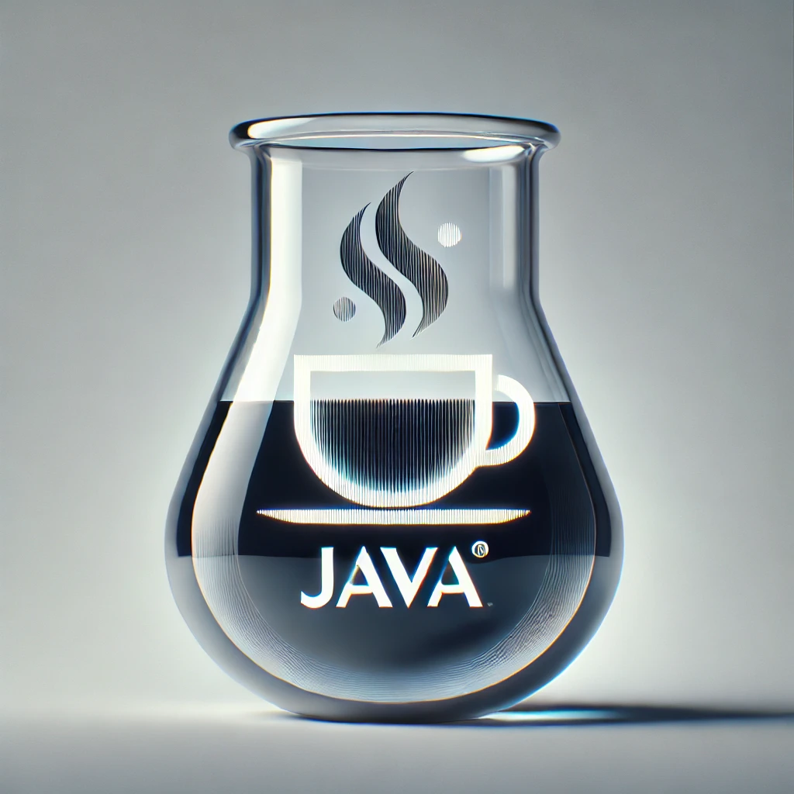

# Java Trial

[](https://github.com/huangsam/java-trial/actions)

Playground to assess new features and popular libraries on Java LTS versions.

Check out my [Kotlin Trial] and [Scala Trial] to learn more about other JVM stacks!



## Getting started

Here are the commands you need to know:

```bash
# Run application
./gradlew run

# Run tests
./gradlew test
```

## Goals

Features tested:

- [x] Annotations
- [x] Concurrency
- [x] File parsing
- [x] Generics
- [x] Optionals
- [x] Properties
- [x] Records
- [x] Reflection
- [x] Streams
- [x] Time constructs
- [x] Try with resources

Libraries tested:

- [x] Gson
- [x] Guava
- [x] JUnit
- [x] Mockito
- [x] SLF4J

## Useful resources

Official resources:

- <https://docs.oracle.com/javase/8/>
- <https://docs.oracle.com/en/java/javase/11/>
- <https://docs.oracle.com/en/java/javase/17/>
- <https://docs.oracle.com/en/java/javase/21/>

Community resources:

- <https://javaalmanac.io/features/>
- <https://docs.gradle.org/current/userguide/platforms.html>
- <https://www.youtube.com/codingwithjohn>
- <https://github.com/akullpp/awesome-java>

[Kotlin Trial]: https://github.com/huangsam/kotlin-trial
[Scala Trial]: https://github.com/huangsam/scala-trial
