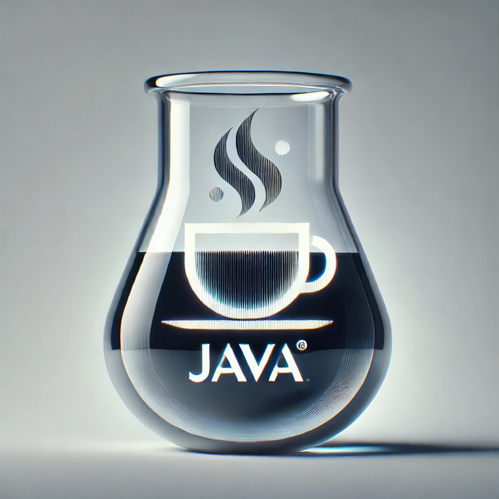

# Java Trial

[](https://github.com/huangsam/java-trial/actions)

Playground to assess new features and popular libraries on Java LTS versions.

Check out my [Kotlin Trial] and [Scala Trial] to try out the other JVM stacks!



## Getting started

Here are the commands you need to know:

```bash
# Run application
./gradlew run

# Run tests
./gradlew test
```

## Useful resources

- **JDK Features**: <https://javaalmanac.io/features/>
- **LTS Docs**: [JDK 17](https://docs.oracle.com/en/java/javase/17/), [JDK 21](https://docs.oracle.com/en/java/javase/21/), [JDK 25](https://docs.oracle.com/en/java/javase/25/)
- **Awesome Java**: <https://github.com/akullpp/awesome-java>

[Kotlin Trial]: https://github.com/huangsam/kotlin-trial
[Scala Trial]: https://github.com/huangsam/scala-trial
